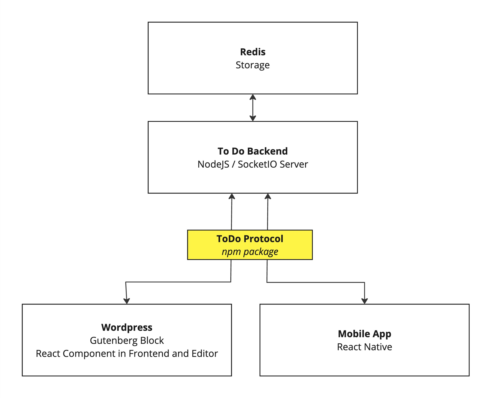

# ToDo POC

## Structure

The project comprises three key applications: WordPress (with a custom-built Gutenberg block), Backend (utilizing Redis storage and Socket.IO for communication), and a Native app (developed in React Native via Expo).



To facilitate communication among different applications and the backend, an npm package was developed. This package acts as a Socket.IO client for applications, simplifying access to backend services and encapsulating core functionalities.

## Demo
See it in action:


## Requirements

- Node 20 (`nvm use` in root folder)
- Docker & Docker Compose

## Installation

### WordPress & Redis (`wordpress`)

1. Execute `docker-compose up` to spin up necessary containers (mysql, redis, wp, wp cli to install).
2. WordPress will be available on http://localhost:8080, and Redis on the default port 6379.

### todo-protocol

1. Build it first as it's a dependency.
2. Run `npm install && npm build`.

### Backend (`todo-backend`)

1. Run `npm install && npm start`.
2. This will start the backend, operating a Socket.IO server on http://localhost:6900 by default.

### WordPress Gutenberg Block (`todo-block`)

1. Activate the WordPress Gutenberg block by placing it in the Plugins directory.
2. After activation, drag and drop it onto the page.

### Native App (`todo-native`)

1. Utilizes Expo for accelerated development.
2. Run `npm install && npm start`.

Commands to be executed in different terminals, all from the root folder:

```bash
$ nvm use # (node 20 required)

$ docker-compose up
$ cd todo-protocol && npm install && npm run build
$ cd todo-block && npm install && npm run build
$ cd todo-backend && npm install && npm start
$ cd todo-native && npm install && npm start
```

Ensure that you have the appropriate Node version activated and Docker installed before running these commands.